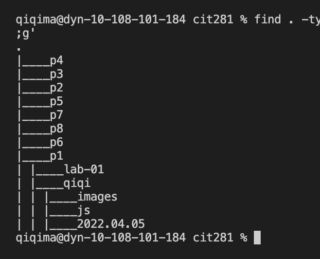

# cit281-project-1
[cit281-project-1](https://github.com/UO-CIT-qiqima/cit281-project-1)

Project 1:

1. I practice to use the command line interface (CLI) of the operating system to create a number of folders.
2. I list the folders in a tree-like structure
3. I practice using the break keyboard sequence
4. I create and execute a JavaScript files using Node.js and Visual Studio Code (VSCode) terminal and Run and Debug.

